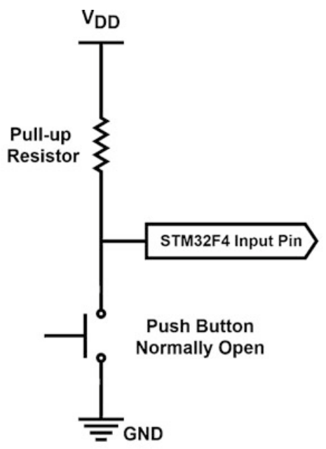
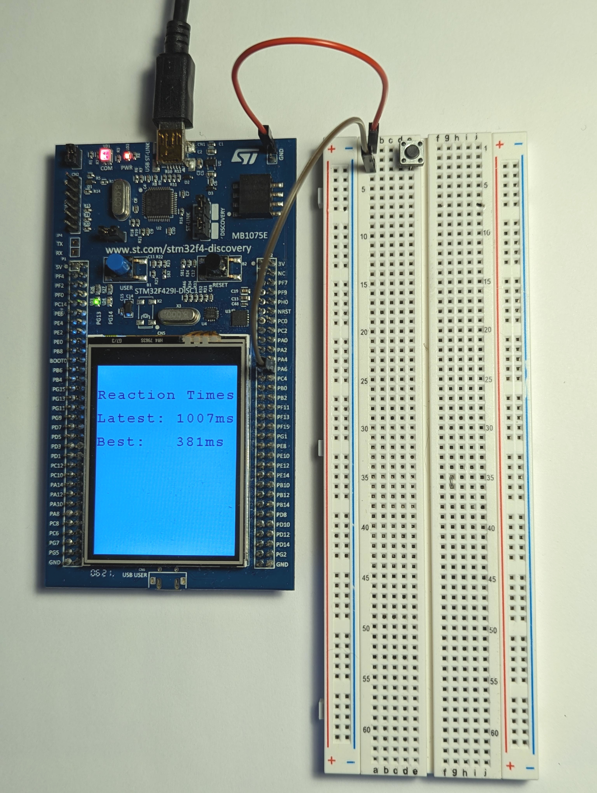

# Lab 02: Reaction Time Tester

## Introduction

In this lab you will be asked to implement a reaction time tester. The purpose is to see how fast you can push a button after an LED light turns on and to display that time on an LCD screen. You will interface the MCU with an external pushbutton as well as with the available user push button and LCD unit on the Discovery board.

## Prelab

**Reading:** This lab combines elements from Chapters 1-6, and 11 of the [course textbook](https://mcmaster.primo.exlibrisgroup.com/permalink/01OCUL_MU/deno1h/alma991028900949707371). You should read and understand those chapters. Note that we will focus on C++ in this course, so you do not need to digest the sections on C or MicroPython. Pay specific attention to Chapter 5 (Interrupts and Power Management), Chapter 6 (Timing Operations), and Chapter 11 (LCD, Touch Screen, and Graphical User Interface Formation). You should also read up on Finite State Machines (FSMs) in this [IEEE Software Article](./readings/Thomas-state-machines.pdf) and this paper on [Finite State Machines in Embedded Applications](./readings/Garbini-state-machines.pdf).

Draw a Finite State Machine (FSM) to implement the behavior described in the Requirements section below. Consider using a table too to describe the system behavior for different push button inputs to make sure you have completely and consistently specified the behavior.
Upload the FSM (in a document or picture file) to Avenue. One copy per group please.

## Hardware 

* STM32F429-Discovery 
* Mini-USB
* Pushbutton
* Breadboard
* 2 breadboard wires
* The LCD screen mounted on the Discovery board is a 2.41", 262K color display with QVGA resolution (240 x 320 dots). The LCD is directly driven by the STM32F429ZIT6 MCU using the RGB protocol. The communication between the MCU and the LCD is done through the SPI interface (for more details, you can find the electrical schematic on p.33 in the STM32F429I Discovery Board User Guide). You will not use the SPI interface directly though, all these low level details are already implemented in the firmware. **We will use a C++ library provided by the textbook authors (details in Setup Procedure below)**.


## Setup Procedure 

1. Log in to [Keil Studio Cloud](https://studio.keil.arm.com/) 
2. Connect your STM32F429-Discovery board to a USB port of your choice. Let Windows try to find the drivers. If the drivers are not found then the st-link usb drivers are missing and you will need assistance from the TAs. 
3. Create new project called “MT2TA4-2025-Lab-02". Go to File -> New -> Mbed Project and select "empty Mbed OS project" from *Example projects* the dropdown. Name the project and uncheck "Initialize this project as a Git repository". 
4. Set *Active project* to MT2TA4-2025-Lab-02 
5. Set *Build target* to DISCO-F429ZI 
6. Set *Connected device* to DISCO-F429ZI 
7. Visit the [BSP](https://os.mbed.com/teams/Embedded-System-Design-with-ARM-Cortex-M/code/BSP_DISCO_F429ZI/) driver page and copy the link under the *Import into Keil Studio* dropdown. Then, in Keil Studio, got to File -> Add MBed Librry to Active Project. Enter the link in the URL field and click next. Select the default branch.
8. Repeat Step 7 to add the [LCD](https://os.mbed.com/teams/Embedded-System-Design-with-ARM-Cortex-M/code/LCD_DISCO_F429ZI/) library to your project.
7. Copy and paste the code from this lab's main.cpp file into main.cpp within your Keil Studio project.
8. Compile and Run the program using the run button: 

This will compile and download the project to the discovery board.
You should see "Hello World" and a running count of the number of seconds since reset printed on the LCD display.

## External Pushbutton

The STM32F429I-Discovery board has only one available user button, so you will need to connect an external pushbutton to the GPIO ports. Generally we need to connect an external pull-up resistor ([wikipedia reference](https://en.wikipedia.org/wiki/Pull-up_resistor)) to the GPIO pin in order to avoid a floating value being read into the input GPIO pin, as shown in the picture below.



**However, instead of an external pull-up resistor, we can make use of the internal pull-up resistor provided by the GPIO port. By doing so, an external push button can be directly connected to one of the pins on the development board (while the other side is connected directly to ground).** Chapter 4 of the textbook (Section 4.3.3.2 C++ Language) discusses this in detail. For example, to configure PA6 as a digital interrupt input with internal pull-up use the following code:
```
InterruptIn external_button(PA_6, PullUp);
```
## Lab Requirements

Write a program to implement the following behaviour using the [Garbini state machine method](./readings/Garbini-state-machines.pdf):
1. Upon a reset signal, flash the grenn LED on the development board at ~10 Hz and wait for a user button (on-board button) press.
2. At the user button press, turn the LED off for a period between 1 and 5 seconds. Figure out a way to make the waiting time random, so that it is harder to predict. You may use the [rand](https://cplusplus.com/reference/cstdlib/rand/) function for this.
3. After the variable time delay, turn on the green LED, start a timer and wait for an onboard user button press. (your code should detect the cheating condition of a pressed button at t=0 and respond by returning to the flashing LED).
4. At the onboard user button press, compute the time between LED illumination and the button press. Display two reaction times on the LCD, one from the latest test, and one from the the fastest recorded test so far. Displayed time should be accurate to 1 mSec.
5. When the external pushbutton is pushed at any time/state, clear the LCD, reset the fastest time, and return to the flashing LED state (number 1 above).

All timing must be done with interrupt-driven hardware timers and not with software wait-loops.

## Marking Scheme

* **10 pts** A Finite State Machine diagram for the behaviour outlined in the requirements.
* **40 pts** A functional program that implements all the requirements correctly.
* **10 pts** Motivate your design and implementation decisions to your TA and answer questions about your code.
* **3 pts** main.cpp source file uploaded to your Avenue drop box for lab-02. In the event your project isn't fully functional, this may be used to justify partial marks.

Be prepared to demo the program you wrote to your TA in lab and also to defend your design and implementation decisions.

## Useful Mbed OS 6 APIs

[DigitalOut](https://os.mbed.com/docs/mbed-os/v6.16/apis/digitalout.html) |
[IterruptIn](https://os.mbed.com/docs/mbed-os/v6.16/apis/interruptin.html) |
[Ticker](https://os.mbed.com/docs/mbed-os/v6.16/apis/ticker.html) |
[Timeout](https://os.mbed.com/docs/mbed-os/v6.16/apis/timeout.html) | 
[Timer](https://os.mbed.com/docs/mbed-os/v6.16/apis/timer.html) |

## Hints

See [textbook](https://mcmaster.primo.exlibrisgroup.com/permalink/01OCUL_MU/deno1h/alma991028900949707371) code Listing 5.4 on page 94 for an example of how to use external interrupts in C++.

## Project Photo



