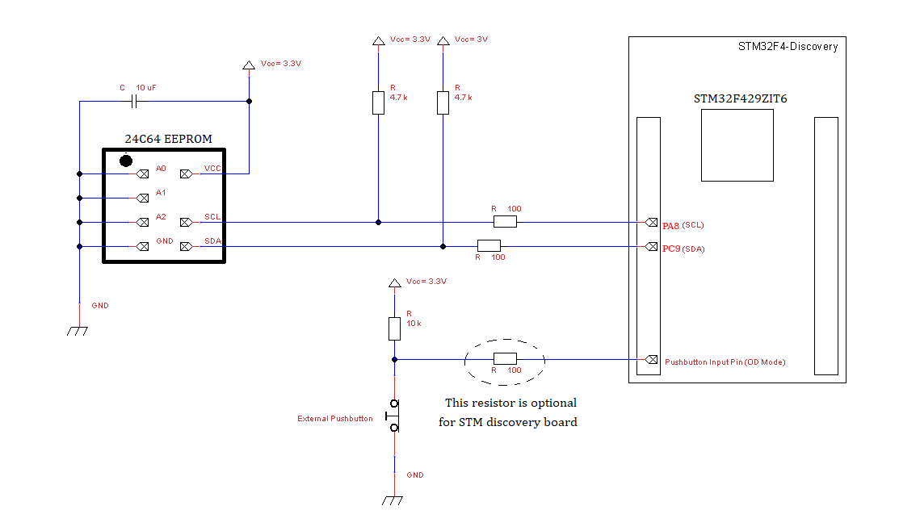
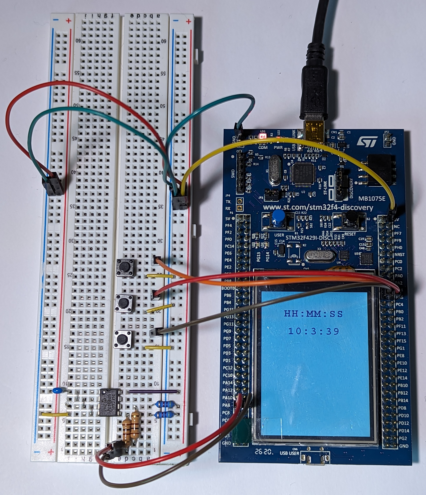

# Lab 03: Serial Communication and Non-Volatile Memory

## Introduction

This lab will help you to understand how the I2C serial communication protocol works. You will interface the STM32F4 Discovery board and STM32F429 MCU with an external 24FC64F EEPROM chip that communicates over I2C, and create the corresponding I2C bus circuit on your breadboard. You will also use the internal real-time clock (RTC) of the STM32F429.

## Prelab
This lab assumes you are familiar with the material required for Lab1 and Lab2. In particular, you should feel comfortable structuring your programs using Finite State Machines.

**Reading:** This lab combines elements from Chapters 1-6, 8, 11  of the [course textbook](https://mcmaster.primo.exlibrisgroup.com/permalink/01OCUL_MU/deno1h/alma991028900949707371). You should read and understand those chapters. Note that we will focus on C++ in this course, so you do not need to digest the sections on C or MicroPython. Pay specific attention to Chapter 8 (Digital Communication) to learn about I2C.
Review the [datasheet](./readings/24FC64F_datasheet.pdf) of the 24FC64F for the I2C EEPROM chip. Focus on p.1-7 paying particular attention to the addressing info at the bottom of page 4.

Draw a FSM that implements the behavior described in the Requirements section below and upload your diagram to avenue before the beginning of your lab session.

## Hardware 

* STM32F429-Discovery 
* Mini-USB
* Pushbutton switch (3)
* Breadboard
* Breadboard wires
* [24FC64F EEPROM](./readings/24FC64F_datasheet.pdf)
* 4.7k resistor (2)
* 100 ohm resistors (2)
* 10 uF capacitor

## Circuit
**The schematic diagram for wiring the STM32F429-DISCO board to EEPROM is given below:**

On the breadboard create the circuit shown above.

The Vcc power sources may be connected to the 3V output pin of the STM32F4 Discovery board. This is sufficient to power everything. As was the case in Lab 2, we will use internal pull-up resistors for the switches instead of external pull-ups. Make sure you have the internal pull-ups enabled! (Note the schematic shows a normally-closed button but we use normally-open buttons). The SCL and SDA lines require external pull-up resistors as shown in the schematic.

## Setup Procedure 

1. Log in to [Keil Studio Cloud](https://studio.keil.arm.com/) 
2. Connect your STM32F429-Discovery board to a USB port of your choice. Let Windows try to find the drivers. If the drivers are not found then the st-link usb drivers are missing and you will need assistance from the TAs. 
3. Create new project called “MT2TA4-2025-Lab-03". Go to File -> New -> Mbed Project and select "empty Mbed OS project" from *Example projects* the dropdown. Name the project and uncheck "Initialize this project as a Git repository". 
4. Set *Active project* to MT2TA4-2025-Lab-03 
5. Set *Build target* to DISCO-F429ZI 
6. Set *Connected device* to DISCO-F429ZI 
7. Visit the [BSP](https://os.mbed.com/teams/Embedded-System-Design-with-ARM-Cortex-M/code/BSP_DISCO_F429ZI/) driver page and copy the link under the *Import into Keil Studio* dropdown. Then, in Keil Studio, got to File -> Add MBed Librry to Active Project. Enter the link in the URL field and click next. Select the default branch.
8. Repeat Step 7 to add the [LCD](https://os.mbed.com/teams/Embedded-System-Design-with-ARM-Cortex-M/code/LCD_DISCO_F429ZI/) library to your project.
7. Copy and paste the code from this lab's main.cpp file into main.cpp within your Keil Studio project.
8. Compile and Run the program using the run button: 

This will compile and download the project to the discovery board.

The demo code provides an example using the internal RTC and displaying a time on the LCD. It also reads and writes some data from/to the 24C64 EEPROM memory. Test your breadboard circuit with the demo code. Using the serial monitor in Keil studio, you should confirm that EEPROM is working as expected, that is, your stored values should persist even if you cycle the power to the Discovery Board and circuit.

## Lab Requirements

Write a program to implement the following behaviour:
1. Detect the time at which the user button on the Discovery board is pressed. Get the time of the button push from the RTC and store it in the 24FC64F EEPROM. You should be writing a log file in the 24FC64F containing the last 2 times the button is pressed.
2. When the circuit is idle, display the current time (HH:MM:SS) on the LCD. 
3. When an external button is pressed, display on the LCD the last two times the user button was pressed as recorded in the 24FC64F EEPROM. The user should be able to exit this display mode by pressing the external button again. (Note that pressing this button after cycling the power should still display the last time the user button was pressed since EEPROM is non-volatile)
4. Use additional external push buttons to set the time/date. Hint: To minimize the number of external push buttons think of using the same strategy as an alarm clock does to set the time and date (i.e., one button to change the value and one button to choose the value to be changed).

All values displayed on the screen should have labels to improve Usability.
All timing must be done with interrupt-driven hardware timers and not with software wait-loops.

## Marking Scheme

* **10 pts** A Finite State Machine diagram for the behaviour outlined in the requirements.
* **40 pts** A functional program that implements all the requirements correctly.
* **10 pts** Motivate your design and implementation decisions to your TA and answer questions about your code.
* **3 pts** main.cpp source file uploaded to your Avenue drop box for lab-03. In the event your project isn't fully functional, this may be used to justify partial marks.

Be prepared to demo the program you wrote to your TA in lab and also to defend your design and implementation decisions.

## Useful Mbed OS 6 APIs

[IterruptIn](https://os.mbed.com/docs/mbed-os/v6.16/apis/interruptin.html) |
[Ticker](https://os.mbed.com/docs/mbed-os/v6.16/apis/ticker.html) |
[Timeout](https://os.mbed.com/docs/mbed-os/v6.16/apis/timeout.html) | 
[Time](https://os.mbed.com/docs/mbed-os/v6.16/apis/time.html) |
[DebouncedInterrupt](https://os.mbed.com/teams/WizziLab/code/DebouncedInterrupt//file/2df374d23986/DebouncedInterrupt.h/)

## Usful C++ Data Structures and Algorithms
[tm](https://cplusplus.com/reference/ctime/tm/) |
[strftime](https://cplusplus.com/reference/ctime/strftime/?kw=strftime)

## Project Photo

