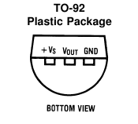
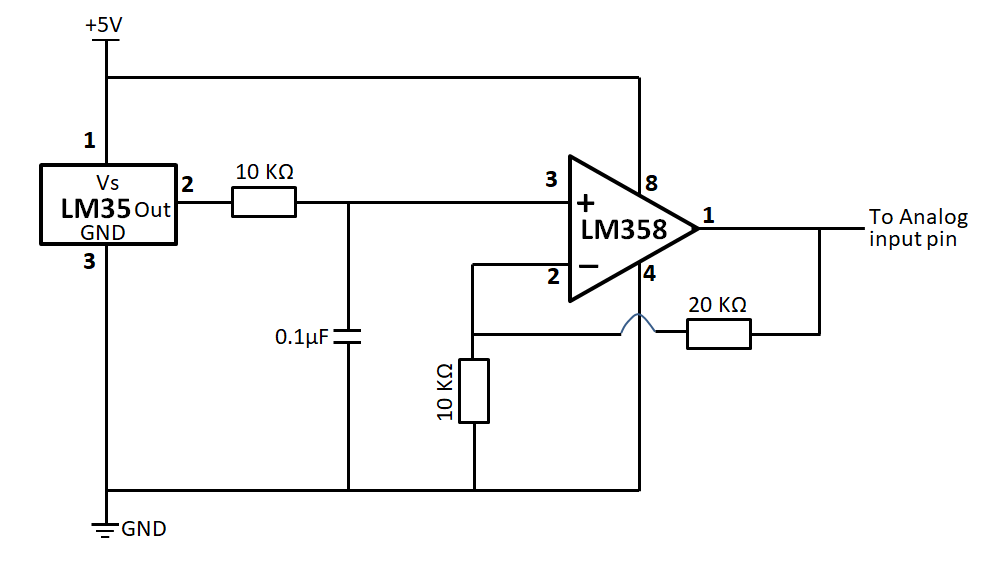
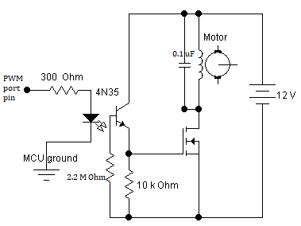
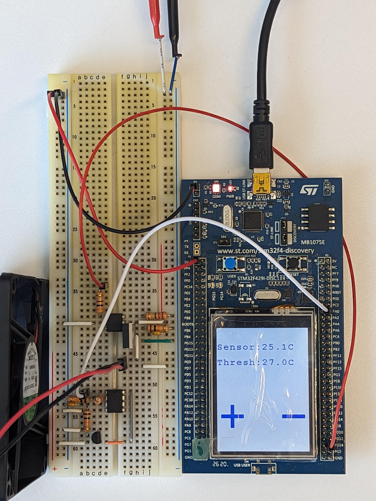

# Lab 04: Digital Thermometer and PWM Fan Controller

## Introduction

You will build a digital thermometer which displays the current temperature and the user selected max temperature on the LCD display. If the temperature exceeds the max, the fan turns on to cool the sensor.

## Prelab
This lab assumes you are familiar with the material required for Labs 0 to 3.

**Reading:** This lab combines elements from Chapters 1-8, 11  of the [course textbook](https://mcmaster.primo.exlibrisgroup.com/permalink/01OCUL_MU/deno1h/alma991028900949707371). You should read and understand those chapters. Note that we will focus on C++ in this course, so you do not need to digest the sections on C or MicroPython. Review the datasheets for the [LM35](./readings/LM35.pdf) temperature sensor,  the [LM358](./readings/LM358.pdf) OpAmp, the [4N35](./readings/4n35.pdf) optocoupler, and the [7N20](./readings/sup57n20.pdf) MOSFET power transistor.

Draw an FSM that implements the behavior described in the Requirements section below.

## Hardware 

* STM32F429-Discovery 
* Mini-USB
* Breadboard
* Breadboard wires
* [LM35](./readings/LM35.pdf) temperature sensor
* [LM358](./readings/LM358.pdf) OpAmp
* [4N35](./readings/4n35.pdf) optocoupler
* [7N20](./readingssup57n20.pdf) MOSFET power transistor
* 10k ohm resistor (3)
* 20k ohm resistor
* 2.2M ohm resistor
* 0.1 uF capacitor (2)

The [LM35](./readings/LM35.pdf) temperature sensor produces a voltage output of 10 mV/degree C. Note that the connections shown in the datasheet are the bottom view of the TO92 package (see below)

You will need to perform an analog-to-digital conversion using the MCU to read the voltage. For optimum accuracy, you will need to amplify the output of the LM35 by a factor of 2 or 3 by using an LM358 OpAmp before feeding it into the A/D converter. Power the LM35 and OpAmp with the 5 volt power supply from the MCU. An example low pass filter and 3x gain signal conditioning circuit is shown below:

The most accurate way to use the ADC requires that you use the internal voltage reference. For each different MCU that you use, measure the 3V Vref and use the measured value in your code.

You will need to drive a fan from the MCU. Fans have motors which can cause nasty inductive spikes to wipe out the transistors in the MCU port. The circuit shown below is fairly safe. An optocoupler completely isolates the MCU from the motor. The resistor grounding the base of the phototransistor in the optocoupler should be set for best fall time, probably around 2.2M ohm. The motor capacitor should start around 0.1uF. Increase it if there is too much spike noise on the analog input, but be sure to use ceramic capacitors, not electrolytic. Electrolytic capacitors are too slow. Check datasheets for the pinout configurations of all components. You must use the lab power supplies for the fan circuit since the fans require 12 volts DC. It is recommended that you use one power rail on your breadboard for the 5 volt supply (from the MCU) and the other for the 12 volt supply ([see project photo](./images/lab-04.jpg)). Double and tripple check your circuit before connecting power!

## Setup Procedure 

1. Log in to [Keil Studio Cloud](https://studio.keil.arm.com/) 
2. Connect your STM32F429-Discovery board to a USB port of your choice. Let your OS try to find the drivers. If the drivers are not found then the st-link usb drivers are missing and you will need assistance from the TAs. 
3. Create new project called “MT2TA4-2025-Lab-04". Go to File -> New -> Mbed Project and select "empty Mbed OS project" from *Example projects* the dropdown. Name the project and uncheck "Initialize this project as a Git repository". 
4. Set *Active project* to MT2TA4-2025-Lab-04 
5. Set *Build target* to DISCO-F429ZI 
6. Set *Connected device* to DISCO-F429ZI 
7. Visit the [BSP](https://os.mbed.com/teams/Embedded-System-Design-with-ARM-Cortex-M/code/BSP_DISCO_F429ZI/) driver page and copy the link under the *Import into Keil Studio* dropdown. Then, in Keil Studio, got to File -> Add MBed Librry to Active Project. Enter the link in the URL field and click next. Select the default branch.
8. Repeat Step 7 to add the [LCD](https://os.mbed.com/teams/Embedded-System-Design-with-ARM-Cortex-M/code/LCD_DISCO_F429ZI/) and [touchscreen](https://os.mbed.com/teams/Embedded-System-Design-with-ARM-Cortex-M/code/TS_DISCO_F429ZI/) libraries to your project.
7. There is no starter main.cpp for this lab. You must start from scratch, but see [lecture demos](../../lecture-demos) for hints.

## Lab Requirements

Write a program and construct a circuit that will:

* **3 pts.** Upon RESET, measure room temperature and display this temperature in degrees Celsius on the LCD along with a "temperature threshold" that is initiallially set 1 degree C greater than room tmperature, rounded to the nerest degree.
* **3 pts.** Implement "+" and "-" buttons using the LCD touchsscreen. These buttons modify the temperature threshold up or down in 0.5 degree increments. The LCD should always print the current room temperature, the temperature threshold, and the threshold control buttons. The buttons should smoothly modify the threshold and they should be visually responsive such that the user clearly understands that buttons are being pressed. For example, they could change colour momentarily when pressed.
* **3 pts.** If the actual sensor temperature is above the threshold, turn on the fan. The fan should point at the LM35 and turn itself off when the temperature sensor reads a temperature lower than the temperature threshold.
* **1 pt.** When the fan turns on, it should spin slowly and gradually increase its speed until it reaches max speed. 

Other requirements:

* **3 pts** A Finite State Machine diagram for the behaviour outlined in the requirements.
* **1 pt** main.cpp source file uploaded to your Avenue drop box for lab-04. In the event your project isn't fully functional, this may be used to justify partial marks. Your code should contain clear and concise comments are important for others to understand your code and even for you later when you need to remember what you did.
* **3 pts** Motivate your design and implementation decisions to your TA and answer questions about your code.
* As usual, all timing in your code should be done with timers and interrupts.

## Useful Mbed OS 6 APIs

[Ticker](https://os.mbed.com/docs/mbed-os/v6.16/apis/ticker.html) |
[Timeout](https://os.mbed.com/docs/mbed-os/v6.16/apis/timeout.html) 

## Project Photo

