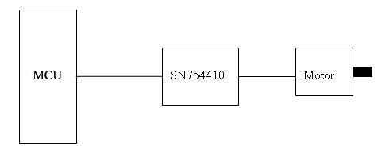
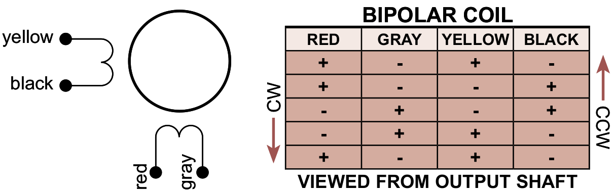

# Lab 05: Control of a Stepper Motor

## Introduction

In this lab you will learn how to interface the STM32F429 MCU with a stepper motor and also how to drive such a motor in full/half step mode and clockwise/counterclockwise direction, while controlling the speed of rotation.

## Prelab
This lab assumes you are familiar with the material required for Labs 0 to 4.

**Reading:** In addition to the class notes, you should read the following:

* [Overview](./readings/Stepper.pdf) of stepper motors, their specifications and terminology
* [Stepper Motor Technology Background](./readings/smh29.pdf)

## Hardware 

The stepper motors used in our lab are of model [26M048B1B](./readings/26M048B.pdf), [35L048B1B](./readings/35L048B.pdf), or [42M048C1B](./readings/42M048C.pdf). They are all bipolar 48 step motors and are rated at 5V. To drive this motor, any of the sequences of signals described in class can be used.

In general, a signal conditioning stage is needed for driving a stepper motor. In the lab we will use the [SN754410NE](./readings/sn754410.pdf) H-bridge driver. In addition, we will use 8 diodes to protect the control circuitry from voltage spikes that would otherwise be produced by the windings (see page 6 of the SN754410 datasheet).

A sequence of signals will be generated using a timer of the STMF429 to control appropriate switches in the H-bridge. The outputs of the H-bridge will be connected to the four terminals of the motor. A block diagram of the equipment arrangement is shown below:

Here is a schematic diagram of the connections to the H-Bridge (SN754410):

The STM32F4-Discovery board cannot handle more than 100mA when powered from the mini-USB. This means you can connect pins 1, 9 and 16 of the H-bridge to the 5V pin of the STM32F4-Discovery board and pin 8 and the output wires (connecting to the motor) to an external power source of 5V (Although in the diagram on page 6 of the SN754410 datasheet, the external power is of 24V, we need to use external power source of 5V, because the stepper motors we use are rated as 5V). The ground pins of the external power source and that of the STM32F4 board should be connected together.

## Setup Procedure 

Connect the motor, STM32F429 board, and SN754410NE according to the schematic diagrams given above. Note that IN 1-4 are your GPIO outputs while OUT 1-4 are your motor connections. To guide your connections, identify the correct datasheet for your motor and look for an image similar to the following **(Your diagram may differ. Make sure you are looking at the correct datasheet)**:

You will want to add some kind of marker such as tape to the motor shaft to easily observe its movement.

## Lab Requirements

### Preliminaries
1. Calculate the angular resolution of the given motor, which makes 48 steps per revolution.
2. In this lab we will use the stepper motor to implement an unusual clock. The motor’s shaft will be connected to a dial of the clock. Hence, we would like the motor to complete one full revolution in a very specific amount of time. The amount of time (in seconds) will be equal to the last two digits of your student numbers. To make times reasonable and fairer across the class, you can adjust this number if it is very low or very high. Please use the following scheme to do that:
    1. If the last two digits of your student number are less than 33, add 33 to it and use that number. E.g. if your student number is 654321, last two digits are 21, which is lower than 33. Then you add 33 to get 54 seconds, which is the period you should use.
    2. If the last two digits are between 33 and 66 (inclusive), use the last two digits unchanged. E.g. if your student number is 123456, you should simply use 56 seconds for the period.
    3. If the last two digits are greater than 66, subtract 33 from it and use that number. E.g. if your student number is 56789, last two digits are 89, which is greater than 66. Then you subtract 33 to get 56 seconds, which is the period you should use.
3. Determine the time period between two steps of the stepper motor used in the lab such that the motor completes one revolution in the time interval calculated in Step 2. Do this for:
    1. Half-stepping sequence.
    2. Full-stepping sequence.

* **15 pts.** Use a multi-line comment at the top of your main.cpp file to report the following:
    * The calculation for the angular resolution of your motor
    * Student 1 name, number, and time period between two steps for 3.1 and 3.2
    * Student 2 name, number, and time period between two steps for 3.1 and 3.2

### Program requirements
Design a program to drive the stepper motor in different modes of operation as follows. 
* **1 pt.** On startup, the motor should not turn and the LCD should be clear.
* **3 pts.** The user button should be used to switch between modes for student 1 and student 2 in your group. In each mode, use the LCD to print the student's name, number, and the number of seconds per revolution for this student. When entering each student mode, print this info to the LCD and run the motor clockwise at the correct speed for the student. On the first button press, you may enter modes for either student and simply switch between students on subsequent button presses. 
* **3 pts.** An external push button should be used to allow the user to cycle between full or half stepping modes without changing the motor speed (seconds per revolution) for the current student. Print the current step mode below the student info on the LCD.
* **3 pts.** A push button should be used to allow the user to change motor direction without changing current student, motor speed, or motor mode (full/half step).
* **2 pts.** The user should be allowed to change the speed of the motor by pressing two buttons, one to increase the speed and one to decrease the speed. Switching students should reset the motor speed to the correct speed for the current student and set clockwise rotation.

Other requirements:

* **1 pt.** main.cpp source file uploaded to your Avenue drop box for lab-05. This is a requirement for lab-05, otherwise you will receive a mark of zero for preliminaries.
* **3 pts** Motivate your design and implementation decisions to your TA and answer questions about your code.

As usual, all timing in your code should be done with timers and interrupts.

## Project Photo

None for this lab. It is a very good idea to sketch your breaboard layout before building the circuit.

